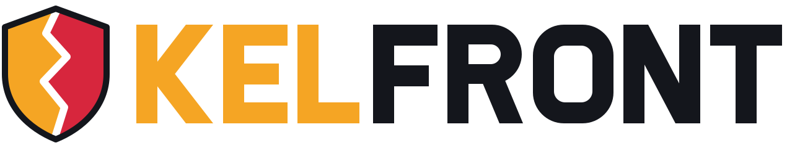

<p align="center">
  <picture>
    <source media="(prefers-color-scheme: dark)" srcset="proprietary/images/KelFrontLogo.svg">
    <source media="(prefers-color-scheme: light)" srcset="proprietary/images/KelFrontLogoDark.svg">
    
  </picture>
</p>

KelFront is an online real-time strategy game focused on territorial control and alliance building. Players compete to expand their territory, build structures, and form strategic alliances in various maps based on real-world geography.

**KelFront is a fork of [OpenFront](https://github.com/openfrontio/OpenFrontIO)** and is not affiliated with or endorsed by OpenFront Inc. OpenFront is itself a fork/rewrite of WarFront.io. Credit to https://github.com/WarFrontIO.

### What differs from upstream OpenFront

- Name and branding are KelFront. The required "© OpenFront and Contributors" notice is kept in the footer and loading screen.
- OpenFront's All-Rights-Reserved `proprietary/` assets (logo, favicon, title font, music, game-start sound) are **not** included. `proprietary/` now holds KelFront's own assets; see [proprietary/LICENSE](proprietary/LICENSE). Regenerate them with `node scripts/generateBrandAssets.mjs` and `node scripts/generateAudio.mjs`.
- OpenFront's ad, analytics, and Apple Pay account bindings, its press kit, and its Terms/Privacy documents are removed.
- The account/stats/cosmetics API is closed-source and not part of this repo, so login, stats, and the store are unavailable unless you run your own API.

[](https://www.gnu.org/licenses/agpl-3.0)
[](https://creativecommons.org/licenses/by-sa/4.0/)

## License

OpenFront source code is licensed under the **GNU Affero General Public License v3.0**

Current copyright notices appear in:

- Footer: "© OpenFront and Contributors"
- Loading screen: "© OpenFront and Contributors"

Modified versions must preserve these notices in reasonably visible locations.

See the [LICENSE](LICENSE) for complete requirements.

For asset licensing, see [LICENSE-ASSETS](LICENSE-ASSETS).  
For license history, see [LICENSING.md](LICENSING.md).

## 🌟 Features

- **Real-time Strategy Gameplay**: Expand your territory and engage in strategic battles
- **Alliance System**: Form alliances with other players for mutual defense
- **Multiple Maps**: Play across various geographical regions including Europe, Asia, Africa, and more
- **Resource Management**: Balance your expansion with defensive capabilities
- **Cross-platform**: Play in any modern web browser

## 📋 Prerequisites

- [Node.js](https://nodejs.org/) v24.15.0 or newer in the Node 24 release line
- [npm](https://www.npmjs.com/) v12.1.0 or newer in the npm 12 release line
- A modern web browser (Chrome, Firefox, Edge, etc.)

Node.js may bundle an older npm version. Upgrade it before installing project dependencies:

```bash
npm install --global --ignore-scripts npm@12.1.0
```

## 🚀 Installation

1. **Clone the repository**

   ```bash
   git clone https://github.com/openfrontio/OpenFrontIO.git
   cd OpenFrontIO
   ```

2. **Install dependencies**

   ```bash
   npm run inst
   ```

   Do NOT use `npm install` nor `npm i` for project dependencies. Use `npm run inst`; it runs the safer `npm ci --ignore-scripts` to install exactly the versions in `package-lock.json` without running lifecycle scripts.

   The repository also rejects dependency releases less than seven days old and dependencies sourced from Git, remote URLs, local tarballs, or directories. Wait until a new release passes the seven-day window before updating it; security exceptions require explicit maintainer review.

## 🎮 Running the Game

### Development Mode

Run both the client and server in development mode with live reloading:

```bash
npm run dev
```

This will:

- Start the webpack dev server for the client
- Launch the game server with development settings
- Open the game in your default browser (to disable this behavior, set `SKIP_BROWSER_OPEN=true` in your environment)

### Client Only

To run just the client with hot reloading:

```bash
npm run start:client
```

### Server Only

To run just the server with development settings:

```bash
npm run start:server-dev
```

### Connecting to staging or production backends

Sometimes it's useful to connect to production servers when replaying a game, testing user profiles, purchases, or login flow.

> To replay a production game, make sure you're on the same commit that the game you want to replay was executed on, you can find the `gitCommit` value via `https://api.openfront.io/game/[gameId]`.
> Unfinished games cannot be replayed on localhost.

To connect to staging api servers:

```bash
npm run dev:staging
```

To connect to production api servers:

```bash
npm run dev:prod
```

## 🛠️ Development Tools

- **Format code**:

  ```bash
  npm run format
  ```

- **Lint code with Oxlint and ESLint**:

  ```bash
  npm run lint
  ```

- **Lint and fix code with Oxlint and ESLint**:

  ```bash
  npm run lint:fix
  ```

- **Testing**
  ```bash
  npm test
  ```

## 🏗️ Project Structure

- `/src/client` - Frontend game client
- `/src/core` - Deterministic game simulation
- `/src/server` - Backend game server
- `/resources` - Static assets (images, maps, etc.)
- `/zbin` - Compact binary wire format for zod schemas (self-contained, zod-only)

## 🤝 Contributing

Contributions and translations are welcome! See [CONTRIBUTING.md](CONTRIBUTING.md) for the workflow, the approved-issue process, project governance, and translation info.
